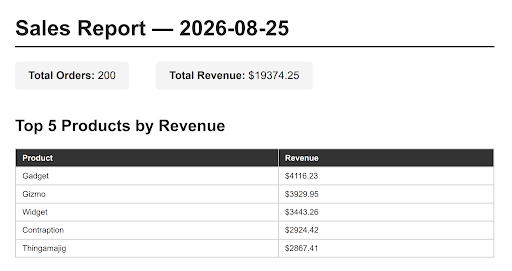

# PDF Report Generator

A small backend service that queries a SQLite database, renders the results into a PDF report using a headless browser, and serves the file by link.

**Dataset chosen:** Option A — the little shop (seeded orders data).

## How to run

1. **Clone the repo and enter the folder:**
   \`\`\`bash
   git clone https://github.com/FathimaWarda963/PDFReportGenerator.git
   cd PDFReportGenerator
   \`\`\`

2. **Create a virtual environment and install dependencies:**
   ```bash
   python3 -m venv venv
   source venv/bin/activate   # Windows: venv\Scripts\activate
   pip install -r requirements.txt
   playwright install chromium

3. **Seed the database:**
   ```bash
   python seed.py

4. **Run the API:**
   ```bash
    uvicorn main:app --reload --port 8000

5. **Generate a report:**
   ```bash
   curl -i -X POST http://localhost:8000/reports


6. **Download it (replace `<id>` with the id from step 5):**
   ```bash
   curl -o my-report.pdf http://localhost:8000/reports/<id>/file


## Aggregation SQL

Total orders and total revenue:
```sql
SELECT COUNT(*) AS count FROM orders;
SELECT SUM(amount) AS total FROM orders;
```

Top 5 products by revenue:
```sql
SELECT product, SUM(amount) AS revenue
FROM orders
GROUP BY product
ORDER BY revenue DESC
LIMIT 5;
```

Orders per day for the last 7 days:
```sql
SELECT created_at AS day, COUNT(*) AS count
FROM orders
WHERE created_at >= ?
GROUP BY created_at
ORDER BY created_at ASC;
```

## Download proof

```bash
$ curl -i -X POST http://localhost:8000/reports
HTTP/1.1 201 Created
{"id":"cc78c670-a2c3-4001-b9be-d7d73fe93a17","file":"/reports/cc78c670-a2c3-4001-b9be-d7d73fe93a17/file"}

$ curl -o my-report.pdf http://localhost:8000/reports/cc78c670-a2c3-4001-b9be-d7d73fe93a17/file
100  66118 100  66118   0      0 264.7k      0 --:--:-- --:--:-- --:--:--
```

## Stage 4 note
Right now report generation happens synchronously inside the POST /reports request, which takes a few seconds. For a single user clicking one button, this is acceptable. I would move this work into a background job (like the Inngest pattern from A7) once report generation grows heavier — e.g., much larger datasets, more complex rendering, or many concurrent users — because a multi-second request blocks the client and doesn't scale well under load.

## Stage 5 note
The duplicate-request check (same day → same report) protects against a user double-clicking "Generate Report" and accidentally creating multiple identical files (and wasted work/storage) for the same day's data. A real-world example: an e-commerce site that emails an order confirmation on each "Generate Invoice" click — without this check, a customer who double-clicks could receive two duplicate confirmation emails, which looks unprofessional and can cause billing confusion.

## PDF sample (page 1)

